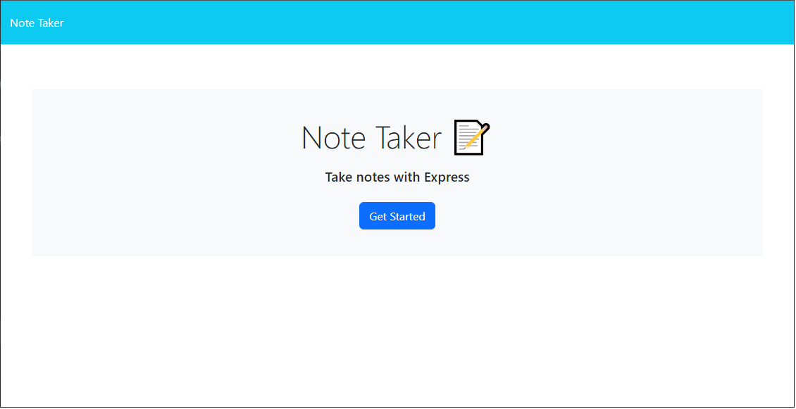
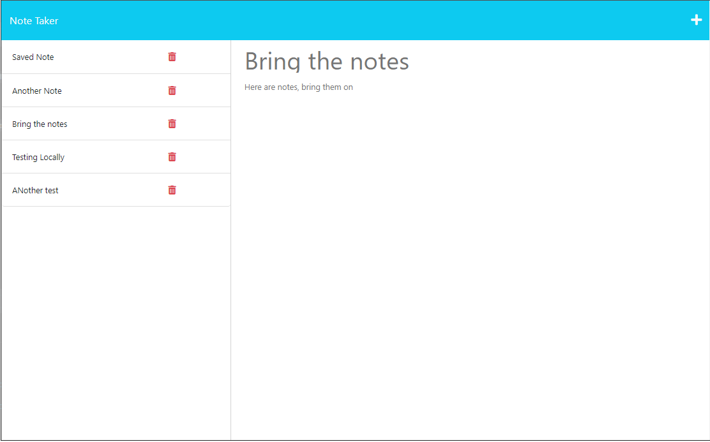

# garretts-todo-list

## Badges

## Description

Below are short descriptions explaining the what, why, and how of this project.

- What was your motivation?
    - To be able to store notes that I can access from my PC or phone.
    - To develop my first application that stores data online rather than locally.

- What problem does this application solve?
    - This application allows for the user to be able to store notes or a to do list online that can be access from any online device.

- What did you learn while working on this?
    - How to store data in JSON files and retreive this data.
    - I learned how to create API routes.
    - I learned how to modularize routes to keep code cleaner and more organized.
  
## Table of Contents

 - [Badges](#badges)
 - [Description](#description)
 - [Installation](#installation)
 - [Usage](#usage)
 - [License](#license)
 - [Features](#features)
 - [Questions](#questions)

## Installation
  
Here is some information that you will need to be able to install and properly work this application:
  - You will need clone this repo and then run "npm i" in your CLI.

## Usage
  
Here are some details on how this application can be used:
  - To run this locally, in your CLI run "node server.js"
  - To see this online you can go to https://rocky-retreat-01110.herokuapp.com/
      
Below a screenshot(s) of the application:
  - 
  - 

## License

The MIT license is being used for this application. For more information you can go to the following URL.
  - https://opensource.org/licenses/MIT

## Features

Some of the main features of this application are:
  - This application and persist data by saving it in a JSON file, or the application can be loaded to Heroku and made available online.
  - A user can Create, Read and Delete notes that have been created.
